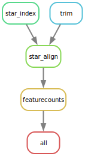

# **Use Case 5: Transcriptomic Analysis Using Snakemake**
In the previous section, we introduced a minimal workflow for transcriptome analysis using bash scripts. There are several issues with that approach that can be solved using a workflow management system, such as Snakemake.

1. The bash script has no explicit dependency tracking. As a result, if trimming fails for one sample, the alignment step will still try to run and may silently produce incomplete results.
2. The Bash script offers no built-in parallelization or scheduling awareness. You must manually manage threads and loops, and adapting the workflow to run on an HPC cluster or cloud platform usually requires rewriting some parts of the script.
3. it is hard to change parameters and inputs in the bash script. For instance, what if we want to change the ref parameter to use GENCODE v44 instead of v34? In the bash script, we will have to rerun all steps starting with the first step, or we will have to create another script with the first steps commented out. However, Snakemake takes care of this issue and will only run the steps that are affected by this change. 


## **Snakemake Alignment Workflow Example**

The same pipeline can be rewritten with Snakemake.

<details>

<summary>**Click to expand Snakefile**</summary>

```python

SAMPLES = ["sample1", "sample2", "sample3", "control1", "control2", "control3"]

REF_FASTA = "reference_genome.fasta"
GTF       = "gencodev33.gtf"

STAR_INDEX = "star_index"


rule all:
    input:
        "counts.txt"


# Step 1 – Trimming
rule trim:
    input:
        r1 = "{sample}_R1.fastq.gz",
        r2 = "{sample}_R2.fastq.gz"
    output:
        r1 = "trimmed/{sample}_R1_val_1.fq.gz",
        r2 = "trimmed/{sample}_R2_val_2.fq.gz"
    shell:
        """
        trim_galore --paired \
            --quality 20 \
            --length 36 \
            --fastqc \
            -o trimmed/ \
            {input.r1} {input.r2}
        """


# Step 2 – STAR index
rule star_index:
    input:
        fasta = REF_FASTA,
        gtf   = GTF
    output:
        directory(STAR_INDEX)
    threads: 16
    shell:
        """
        STAR --runMode genomeGenerate \
            --genomeDir {output} \
            --genomeFastaFiles {input.fasta} \
            --sjdbGTFfile {input.gtf} \
            --sjdbOverhang 100 \
            --runThreadN {threads}
        """


# Step 3 – Alignment
rule star_align:
    input:
        index = STAR_INDEX,
        r1    = "trimmed/{sample}_R1_val_1.fq.gz",
        r2    = "trimmed/{sample}_R2_val_2.fq.gz"
    output:
        bam = "aligned/{sample}_Aligned.sortedByCoord.out.bam"
    threads: 8
    shell:
        """
        STAR --genomeDir {input.index} \
            --readFilesIn {input.r1} {input.r2} \
            --readFilesCommand zcat \
            --outFileNamePrefix aligned/{wildcards.sample}_ \
            --outSAMtype BAM SortedByCoordinate \
            --outSAMunmapped Within \
            --outSAMattributes Standard \
            --runThreadN {threads}
        """


# Step 4 – featureCounts
rule featurecounts:
    input:
        bams = expand(
            "aligned/{sample}_Aligned.sortedByCoord.out.bam",
            sample=SAMPLES
        ),
        gtf = GTF
    output:
        "counts.txt"
    threads: 8
    shell:
        """
        featureCounts -p -T {threads} \
            -a {input.gtf} \
            -o {output} \
            {input.bams}
        """
```


</details>

## **Snakemake rule graph**
A Snakemake rulegraph is a visual directed acyclic graph that shows the logical connections between your rules, illustrating how the overall pipeline is structured. The rulegraph for our pipeline looks like following and can be created by running `snakemake --rulegraph | dot -Tsvg > rulegraph.svg`.

<details> 

<summary>**Click to expand snakemake rule graph**</summary>



</details>

## **snakemake -n**

To see which exact rules are going to be executed, you should run `snakemake -n`. This builds the DAG and shows the rules that are going to be executed without actually running anything. 

<details>

<summary>**Click to expand output of `snakemake -n`**</summary>

```text
Building DAG of jobs...
Job stats:
job              count
-------------  -------
all                  1
featurecounts        1
star_align           6
star_index           1
trim                 6
total               15


[Wed Mar  4 17:18:03 2026]
rule trim:
    input: control1_R1.fastq.gz, control1_R2.fastq.gz
    output: trimmed/control1_R1_val_1.fq.gz, trimmed/control1_R2_val_2.fq.gz
    jobid: 10
    reason: Missing output files: trimmed/control1_R1_val_1.fq.gz, trimmed/control1_R2_val_2.fq.gz
    wildcards: sample=control1
    resources: tmpdir=/var/folders/wl/ccbkx2x53rs2q3v4wdx3k7m40000gn/T
[Wed Mar  4 17:18:03 2026]
rule trim:
    input: control3_R1.fastq.gz, control3_R2.fastq.gz
    output: trimmed/control3_R1_val_1.fq.gz, trimmed/control3_R2_val_2.fq.gz
    jobid: 14
    reason: Missing output files: trimmed/control3_R1_val_1.fq.gz, trimmed/control3_R2_val_2.fq.gz
    wildcards: sample=control3
    resources: tmpdir=/var/folders/wl/ccbkx2x53rs2q3v4wdx3k7m40000gn/T
[Wed Mar  4 17:18:03 2026]
rule trim:
    input: sample1_R1.fastq.gz, sample1_R2.fastq.gz
    output: trimmed/sample1_R1_val_1.fq.gz, trimmed/sample1_R2_val_2.fq.gz
    jobid: 4
    reason: Missing output files: trimmed/sample1_R1_val_1.fq.gz, trimmed/sample1_R2_val_2.fq.gz
    wildcards: sample=sample1
    resources: tmpdir=/var/folders/wl/ccbkx2x53rs2q3v4wdx3k7m40000gn/T
[Wed Mar  4 17:18:03 2026]
rule trim:
    input: sample3_R1.fastq.gz, sample3_R2.fastq.gz
    output: trimmed/sample3_R1_val_1.fq.gz, trimmed/sample3_R2_val_2.fq.gz
    jobid: 8
    reason: Missing output files: trimmed/sample3_R1_val_1.fq.gz, trimmed/sample3_R2_val_2.fq.gz
    wildcards: sample=sample3
    resources: tmpdir=/var/folders/wl/ccbkx2x53rs2q3v4wdx3k7m40000gn/T
[Wed Mar  4 17:18:03 2026]
rule trim:
    input: control2_R1.fastq.gz, control2_R2.fastq.gz
    output: trimmed/control2_R1_val_1.fq.gz, trimmed/control2_R2_val_2.fq.gz
    jobid: 12
    reason: Missing output files: trimmed/control2_R1_val_1.fq.gz, trimmed/control2_R2_val_2.fq.gz
    wildcards: sample=control2
    resources: tmpdir=/var/folders/wl/ccbkx2x53rs2q3v4wdx3k7m40000gn/T
[Wed Mar  4 17:18:03 2026]
rule star_index:
    input: reference_genome.fasta, gencodev33.gtf
    output: star_index
    jobid: 3
    reason: Missing output files: star_index
    threads: 16
    resources: tmpdir=/var/folders/wl/ccbkx2x53rs2q3v4wdx3k7m40000gn/T
[Wed Mar  4 17:18:03 2026]
rule trim:
    input: sample2_R1.fastq.gz, sample2_R2.fastq.gz
    output: trimmed/sample2_R1_val_1.fq.gz, trimmed/sample2_R2_val_2.fq.gz
    jobid: 6
    reason: Missing output files: trimmed/sample2_R2_val_2.fq.gz, trimmed/sample2_R1_val_1.fq.gz
    wildcards: sample=sample2
    resources: tmpdir=/var/folders/wl/ccbkx2x53rs2q3v4wdx3k7m40000gn/T
[Wed Mar  4 17:18:03 2026]
rule star_align:
    input: star_index, trimmed/sample1_R1_val_1.fq.gz, trimmed/sample1_R2_val_2.fq.gz
    output: aligned/sample1_Aligned.sortedByCoord.out.bam
    jobid: 2
    reason: Missing output files: aligned/sample1_Aligned.sortedByCoord.out.bam; Input files updated by another job: star_index, trimmed/sample1_R1_val_1.fq.gz, trimmed/sample1_R2_val_2.fq.gz
    wildcards: sample=sample1
    threads: 8
    resources: tmpdir=/var/folders/wl/ccbkx2x53rs2q3v4wdx3k7m40000gn/T
[Wed Mar  4 17:18:03 2026]
rule star_align:
    input: star_index, trimmed/sample2_R1_val_1.fq.gz, trimmed/sample2_R2_val_2.fq.gz
    output: aligned/sample2_Aligned.sortedByCoord.out.bam
    jobid: 5
    reason: Missing output files: aligned/sample2_Aligned.sortedByCoord.out.bam; Input files updated by another job: star_index, trimmed/sample2_R2_val_2.fq.gz, trimmed/sample2_R1_val_1.fq.gz
    wildcards: sample=sample2
    threads: 8
    resources: tmpdir=/var/folders/wl/ccbkx2x53rs2q3v4wdx3k7m40000gn/T
[Wed Mar  4 17:18:03 2026]
rule star_align:
    input: star_index, trimmed/control1_R1_val_1.fq.gz, trimmed/control1_R2_val_2.fq.gz
    output: aligned/control1_Aligned.sortedByCoord.out.bam
    jobid: 9
    reason: Missing output files: aligned/control1_Aligned.sortedByCoord.out.bam; Input files updated by another job: star_index, trimmed/control1_R1_val_1.fq.gz, trimmed/control1_R2_val_2.fq.gz
    wildcards: sample=control1
    threads: 8
    resources: tmpdir=/var/folders/wl/ccbkx2x53rs2q3v4wdx3k7m40000gn/T
[Wed Mar  4 17:18:03 2026]
rule star_align:
    input: star_index, trimmed/control3_R1_val_1.fq.gz, trimmed/control3_R2_val_2.fq.gz
    output: aligned/control3_Aligned.sortedByCoord.out.bam
    jobid: 13
    reason: Missing output files: aligned/control3_Aligned.sortedByCoord.out.bam; Input files updated by another job: star_index, trimmed/control3_R1_val_1.fq.gz, trimmed/control3_R2_val_2.fq.gz
    wildcards: sample=control3
    threads: 8
    resources: tmpdir=/var/folders/wl/ccbkx2x53rs2q3v4wdx3k7m40000gn/T
[Wed Mar  4 17:18:03 2026]
rule star_align:
    input: star_index, trimmed/sample3_R1_val_1.fq.gz, trimmed/sample3_R2_val_2.fq.gz
    output: aligned/sample3_Aligned.sortedByCoord.out.bam
    jobid: 7
    reason: Missing output files: aligned/sample3_Aligned.sortedByCoord.out.bam; Input files updated by another job: star_index, trimmed/sample3_R1_val_1.fq.gz, trimmed/sample3_R2_val_2.fq.gz
    wildcards: sample=sample3
    threads: 8
    resources: tmpdir=/var/folders/wl/ccbkx2x53rs2q3v4wdx3k7m40000gn/T
[Wed Mar  4 17:18:03 2026]
rule star_align:
    input: star_index, trimmed/control2_R1_val_1.fq.gz, trimmed/control2_R2_val_2.fq.gz
    output: aligned/control2_Aligned.sortedByCoord.out.bam
    jobid: 11
    reason: Missing output files: aligned/control2_Aligned.sortedByCoord.out.bam; Input files updated by another job: star_index, trimmed/control2_R1_val_1.fq.gz, trimmed/control2_R2_val_2.fq.gz
    wildcards: sample=control2
    threads: 8
    resources: tmpdir=/var/folders/wl/ccbkx2x53rs2q3v4wdx3k7m40000gn/T
[Wed Mar  4 17:18:03 2026]
rule featurecounts:
    input: aligned/sample1_Aligned.sortedByCoord.out.bam, aligned/sample2_Aligned.sortedByCoord.out.bam, aligned/sample3_Aligned.sortedByCoord.out.bam, aligned/control1_Aligned.sortedByCoord.out.bam, aligned/control2_Aligned.sortedByCoord.out.bam, aligned/control3_Aligned.sortedByCoord.out.bam, gencodev33.gtf
    output: counts.txt
    jobid: 1
    reason: Missing output files: counts.txt; Input files updated by another job: aligned/sample3_Aligned.sortedByCoord.out.bam, aligned/control1_Aligned.sortedByCoord.out.bam, aligned/control3_Aligned.sortedByCoord.out.bam, aligned/sample2_Aligned.sortedByCoord.out.bam, aligned/sample1_Aligned.sortedByCoord.out.bam, aligned/control2_Aligned.sortedByCoord.out.bam
    threads: 8
    resources: tmpdir=/var/folders/wl/ccbkx2x53rs2q3v4wdx3k7m40000gn/T
[Wed Mar  4 17:18:03 2026]
rule all:
    input: counts.txt
    jobid: 0
    reason: Input files updated by another job: counts.txt
    resources: tmpdir=/var/folders/wl/ccbkx2x53rs2q3v4wdx3k7m40000gn/T
Job stats:
job              count
-------------  -------
all                  1
featurecounts        1
star_align           6
star_index           1
trim                 6
total               15

Reasons:
    (check individual jobs above for details)
    input files updated by another job:
        all, featurecounts, star_align
    output files have to be generated:
        featurecounts, star_align, star_index, trim
This was a dry-run (flag -n). The order of jobs does not reflect the order of execution.

```

</details>

